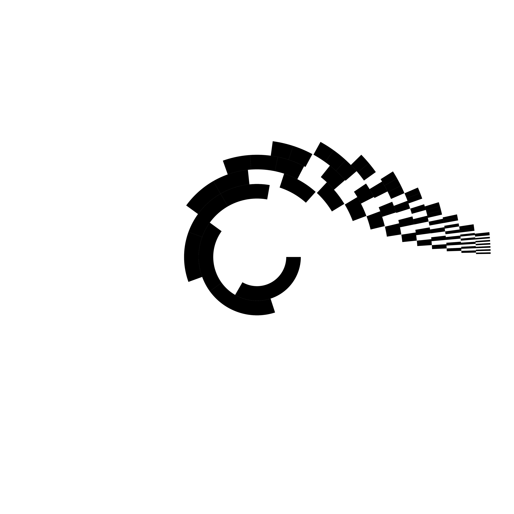
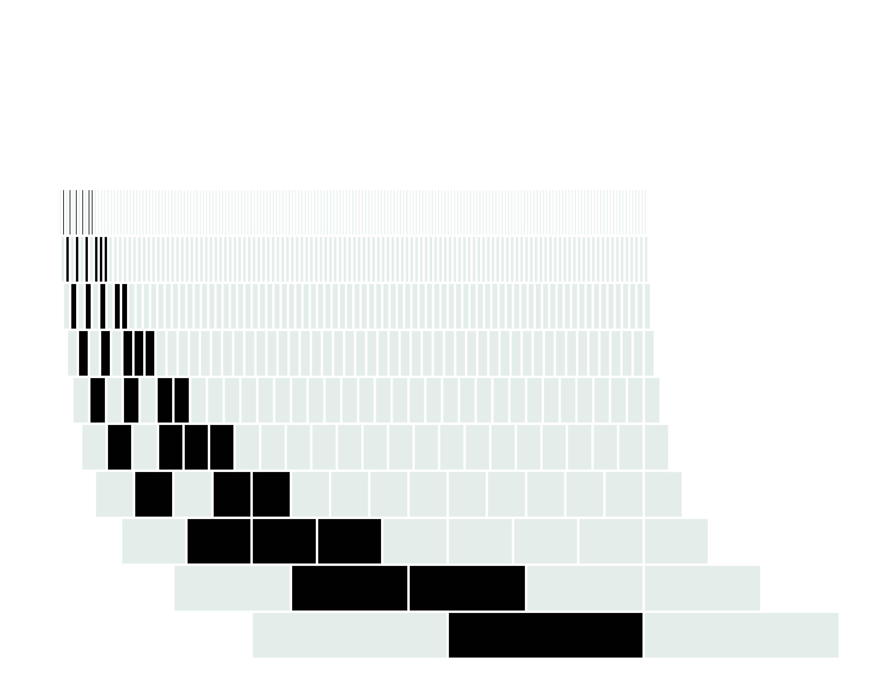
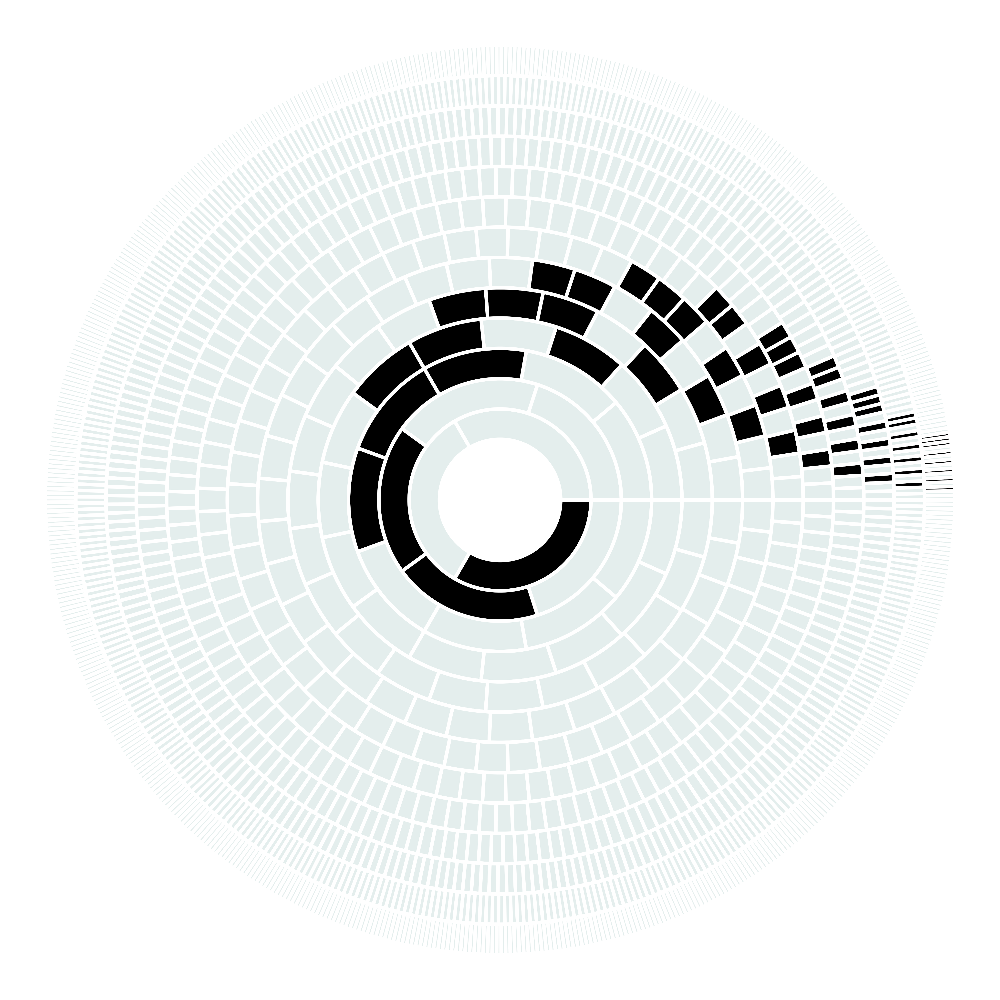

# reca

radial elementary cellular automaton experimentation. the code is not pretty, nor fast, but it's okay as an experiment.

### how it works?

<table>
  <tbody>
    <tr>
      <td colspan="3">
        for the most part this is just a simple (and probably buggy) elementary cellular automaton https://en.wikipedia.org/wiki/Elementary_cellular_automaton, with an added wraparound at the edges that can be enabled. However the twist is that the projection happens on a polar grid instead of cartesian. Combined with the wraparound this creates a radial elementary cellular automaton. Rendering is being done via matplotlib, each row of the automaton becomes a bar chart with the number of cells it has. All bar charts have the same total length and are then placed on a polar plot.
      </td>
    </tr>
    <tr>
      <td>
        
      </td>
      <td>
        
      </td>
      <td>
        
      </td>
    </tr>
  </tbody>
</table>

### usage

'''
usage: RECA [-h] [-i ITERATIONS] [-r RULE] [-s START [START ...]] [-a] [-m MULT] [-n] [-S]

Radial Elementary Cellular Automaton

options:
  -h, --help            show this help message and exit
  -i ITERATIONS, --iterations ITERATIONS
                        number of iterations
  -r RULE, --rule RULE  ruleset, 0-255
  -s START [START ...], --start START [START ...]
                        start condition, must be a list of bits, e.g. [0,1,0]
  -a, --alt             alternative wrapover
  -m MULT, --mult MULT  cell growth factor
  -n, --no-display      display the plot
  -S, --save            save the plot

e.g. python3 recy.py -i 14 -Sn  # 14 iterations, do not display the plot, but save the figure
'''